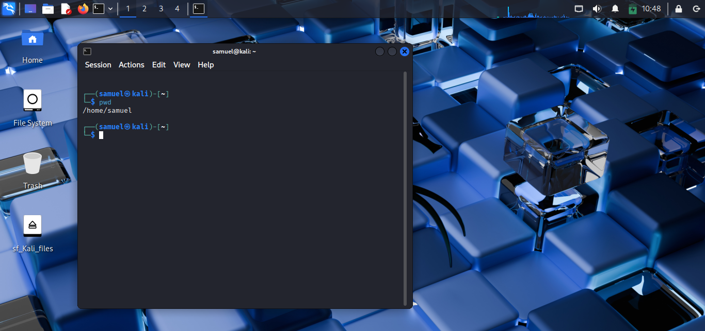
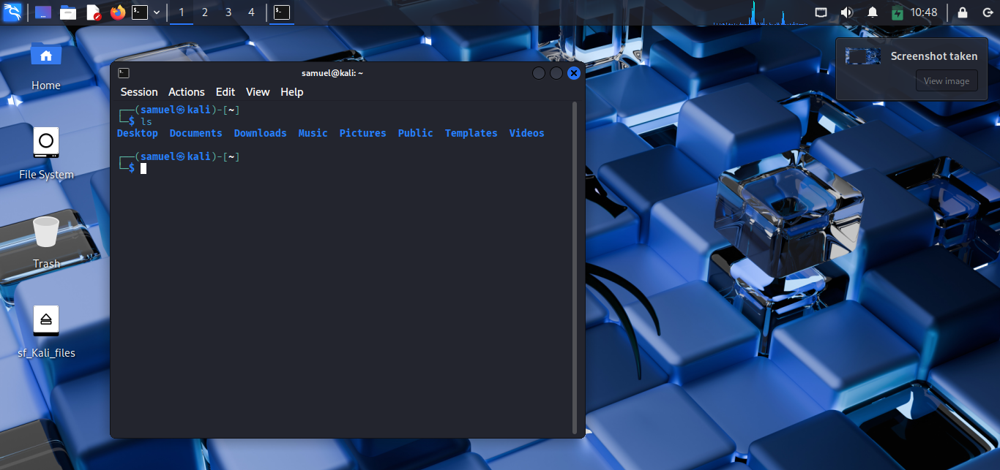
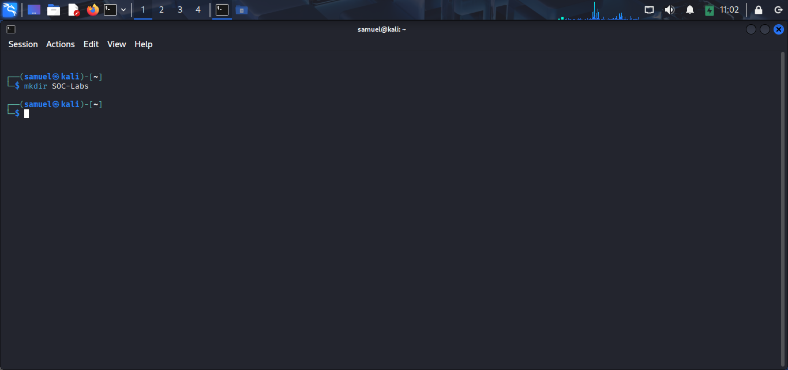
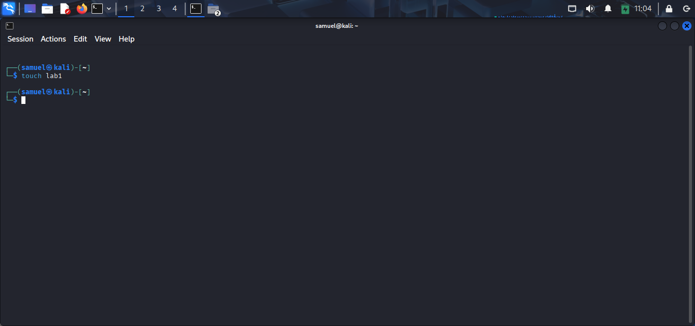
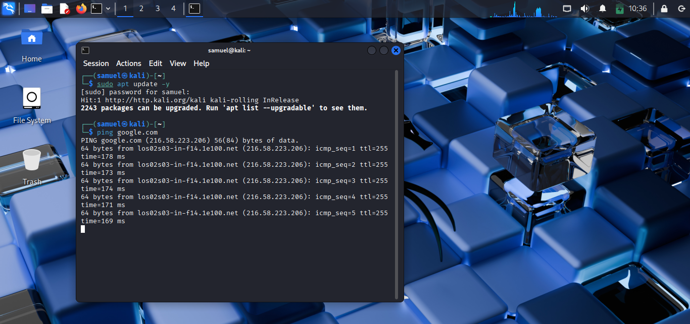
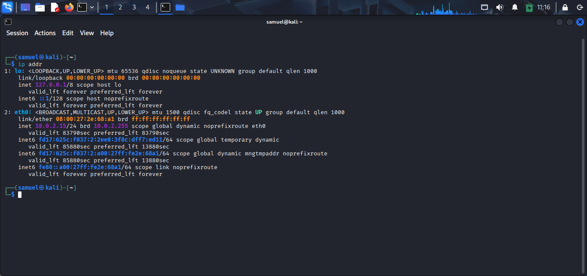
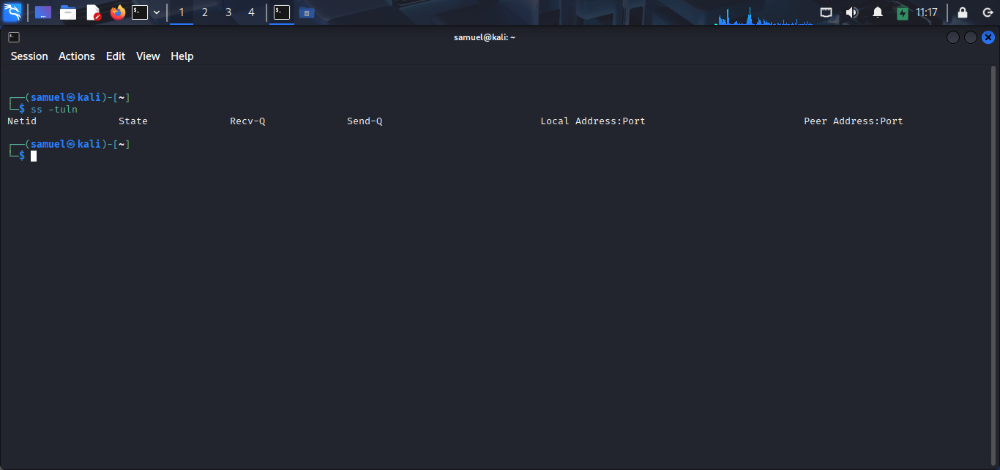

# Lab 03 – Linux Basics

## Objective

The objective of this lab was to learn and practice fundamental Linux commands used for navigation, file management, and basic network troubleshooting. These commands form part of the daily workflow of many SOC Analysts and Linux administrators.

---

## Environment

- Operating System: Kali Linux
- Terminal: Bash
- Virtualization: VirtualBox

---

## Commands Practiced

| Command | Description |
|---------|-------------|
| `pwd` | Displays the current working directory |
| `ls` | Lists files and directories |
| `ls -la` | Lists all files, including hidden files, with detailed information |
| `cd` | Changes the current directory |
| `mkdir` | Creates a new directory |
| `touch` | Creates an empty file |
| `cp` | Copies files or directories |
| `mv` | Moves or renames files and directories |
| `rm` | Deletes files |
| `rmdir` | Deletes empty directories |
| `ping` | Tests connectivity to another host |
| `ip addr` | Displays network interface and IP address information |
| `ss -tuln` | Displays listening ports and active network connections |

---

## Screenshots

### Current Directory



### Listing Files



### Creating a Directory



### Creating a File



### Network Connectivity Test



### Viewing IP Address



### Viewing Listening Ports



---

## What I Learned

- How to navigate the Linux file system.
- How to create, move, rename, and delete files and directories.
- How to verify internet connectivity.
- How to identify the IP address assigned to my system.
- How to inspect listening network ports and services.

---

## Challenges Faced

While practicing the `mkdir` command, I initially encountered the error:

```text
mkdir: missing operand
```

I learned that the command requires a directory name as an argument. After providing a valid folder name, the command executed successfully.

---

## SOC Relevance

Linux is widely used in enterprise servers, cloud environments, and security operations. SOC Analysts frequently use Linux commands to:

- Navigate systems during investigations.
- Manage files and directories.
- Verify network connectivity.
- Collect system information.
- Troubleshoot operating system and network issues.

Developing confidence with the Linux terminal is an essential step toward becoming a SOC Analyst.

---

## Outcome

Successfully practiced and documented essential Linux commands used for navigation, file management, and basic networking in Kali Linux.
