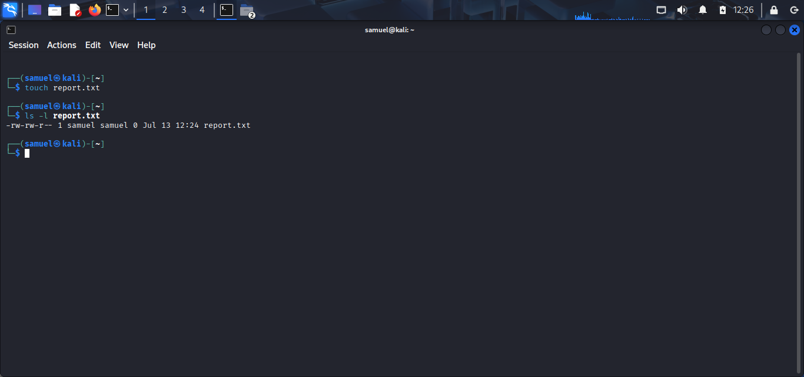
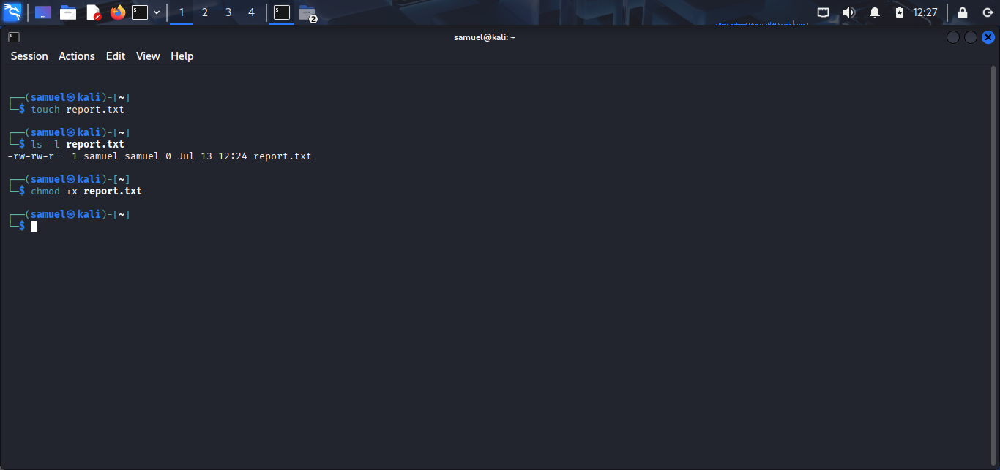
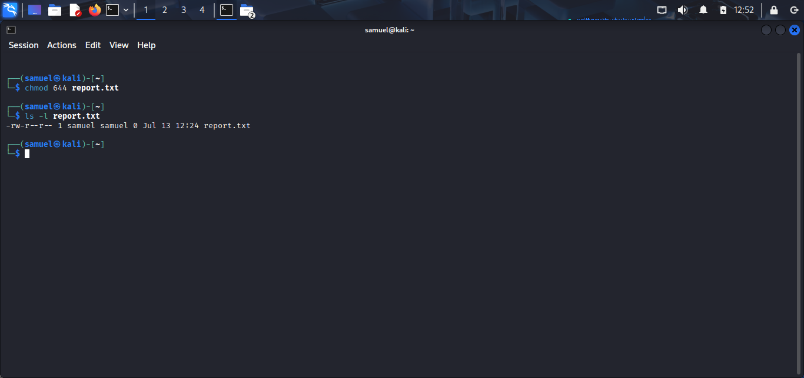
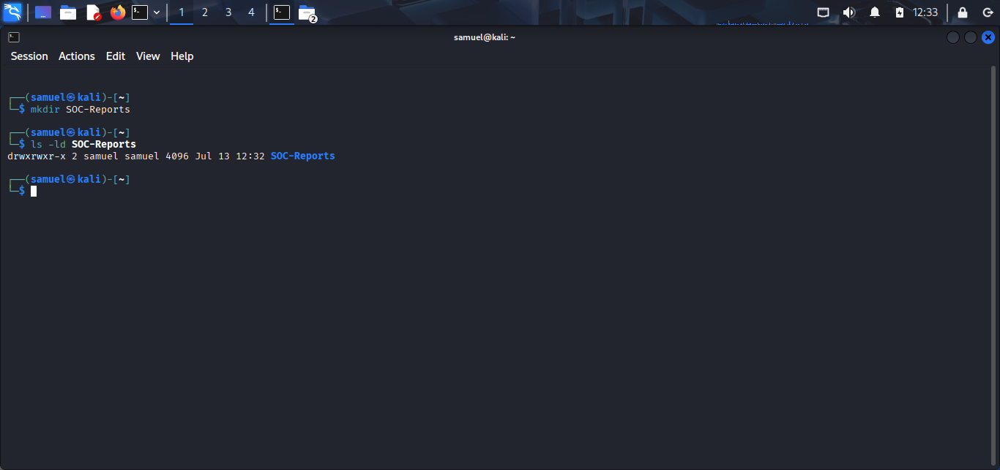
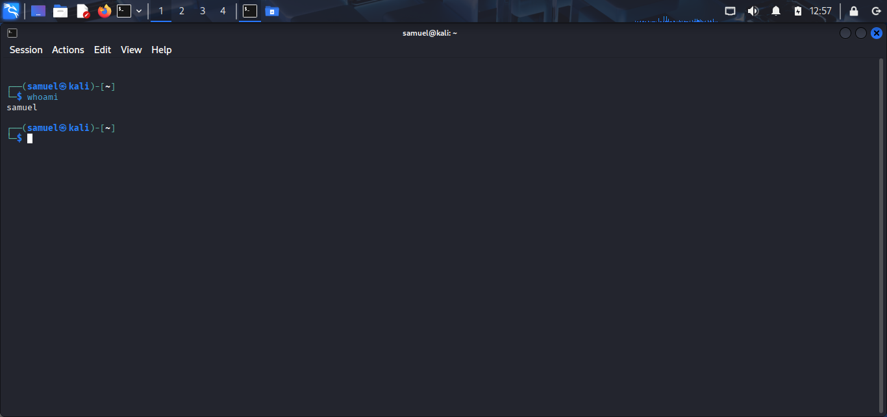
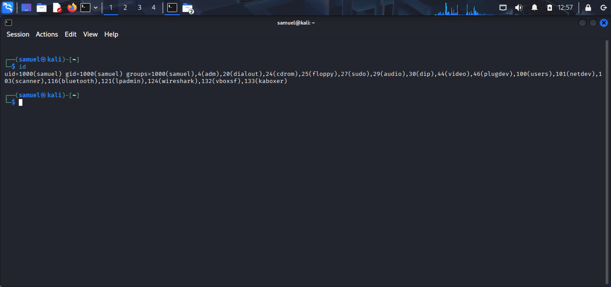

# Lab 04 – Linux File Permissions

## Objective

The objective of this lab was to understand how Linux manages access to files and directories using permissions. I learned how to view, modify, and interpret file permissions, as well as understand file ownership and its importance in system security.

---

## Environment

- Operating System: Kali Linux
- Shell: Bash
- Virtualization: VirtualBox

---

## Learning Objectives

- Understand Linux file permissions
- Learn the meaning of Read, Write, and Execute permissions
- Identify file ownership
- Modify permissions using symbolic and numeric notation
- Understand the importance of file permissions in cybersecurity

---

## Key Concepts

### File Permissions

Linux controls access to files and directories using three permission types:

| Permission | Symbol | Description |
|------------|--------|-------------|
| Read | `r` | Allows viewing the contents of a file or listing a directory |
| Write | `w` | Allows modifying a file or creating/removing files inside a directory |
| Execute | `x` | Allows executing a file or entering a directory |

Permissions are assigned to three categories:

- **Owner (User)**
- **Group**
- **Others**

Example:

```text
-rwxr-xr--
```

Breakdown:

| Section | Meaning |
|---------|---------|
| `-` | Regular file |
| `rwx` | Owner has Read, Write and Execute |
| `r-x` | Group has Read and Execute |
| `r--` | Others have Read only |

---

## Commands Practiced

| Command | Purpose |
|---------|---------|
| `ls -l` | Display file permissions |
| `touch report.txt` | Create a new file |
| `chmod +x report.txt` | Add execute permission |
| `chmod -x report.txt` | Remove execute permission |
| `chmod 755 report.txt` | Set permissions using numeric notation |
| `chmod 644 report.txt` | Set standard file permissions |
| `mkdir SOC-Reports` | Create a directory |
| `ls -ld SOC-Reports` | View directory permissions |
| `whoami` | Display current user |
| `id` | Display user and group information |

---

## Screenshots

### Viewing File Permissions


---

### Creating a File



---

### Adding Execute Permission



---

### Numeric Permissions (755)


---

### Numeric Permissions (644)



---

### Directory Permissions



---

### User Information



---

### User and Group IDs



---

## What I Learned

- How Linux controls access to files and directories.
- The meaning of Read, Write, and Execute permissions.
- The difference between Owner, Group, and Others.
- How to modify permissions using symbolic notation (`+x`, `-x`).
- How to use numeric permissions such as `755` and `644`.
- How to identify file ownership.

---

## Challenges Faced

Initially, understanding numeric permissions (755 and 644) was confusing. After practicing with `chmod` and observing the output using `ls -l`, I understood how each number represents a combination of Read, Write, and Execute permissions.

---

## SOC Relevance

Linux file permissions are fundamental to cybersecurity because they determine who can access or modify files.

SOC Analysts frequently examine permissions to:

- Investigate unauthorized file modifications.
- Detect suspicious executable files.
- Verify access to sensitive files.
- Identify privilege escalation attempts.
- Support incident response investigations.

Understanding Linux permissions helps security professionals maintain system integrity and reduce unauthorized access.

---

## Outcome

Successfully practiced viewing and modifying Linux file permissions using both symbolic and numeric methods while understanding their role in securing Linux systems.
