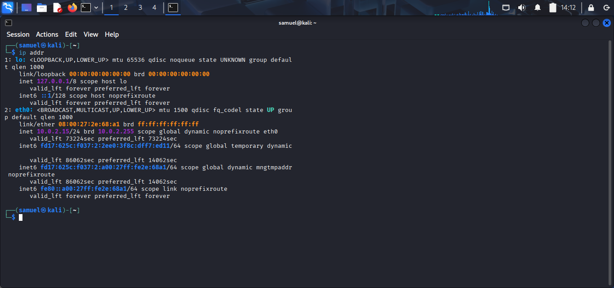
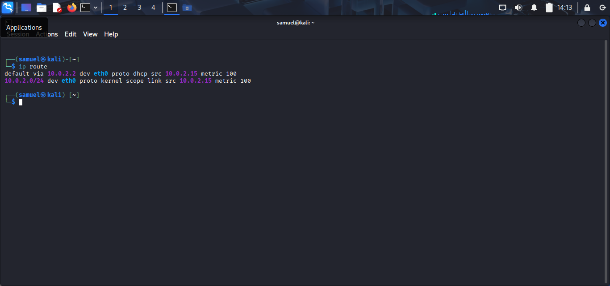
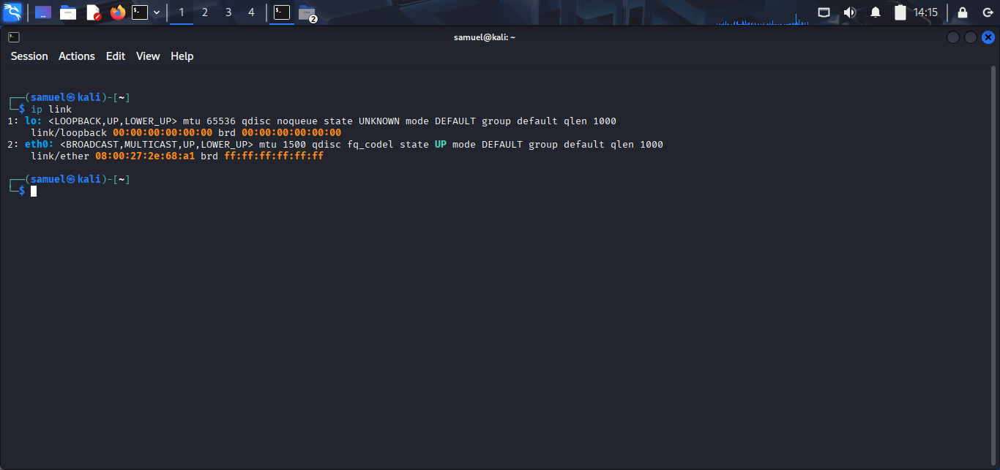
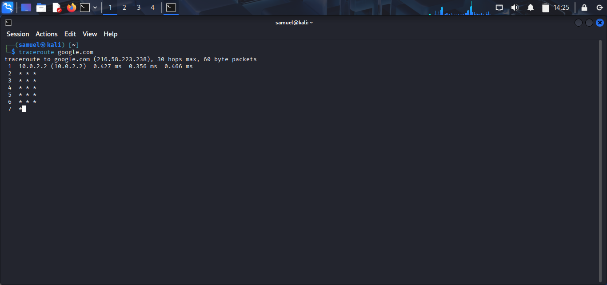

# Lab 03 – Linux Networking

## Objective

The objective of this lab was to learn and practice essential Linux networking commands used to inspect network configurations, verify connectivity, troubleshoot network issues, and gather network information. These commands are fundamental for Security Operations Center (SOC) Analysts when investigating systems and responding to security incidents.

---

## Environment

- **Operating System:** Kali Linux
- **Shell:** Bash
- **Virtualization:** VirtualBox

---

## Learning Objectives

By completing this lab, I aimed to:

- Understand Linux network interfaces.
- View IP and MAC address information.
- Display the routing table.
- Test network connectivity.
- Inspect listening ports and active connections.
- Perform DNS lookups.
- Retrieve web content using the terminal.
- Trace the path packets take across a network.

---

## Background Theory

Linux provides built-in networking tools that allow administrators and security professionals to inspect, monitor, and troubleshoot networks. Understanding these commands helps SOC Analysts identify connectivity problems, investigate suspicious traffic, verify configurations, and collect information during incident response.

---

## Commands Practiced

| Command | Purpose |
|---------|---------|
| `ip addr` | Display IP addresses and network interfaces |
| `ip route` | Display the routing table and default gateway |
| `ip link` | View network interfaces and MAC addresses |
| `ping google.com` | Test internet connectivity using a hostname |
| `ping 8.8.8.8` | Test connectivity using an IP address |
| `ss -tuln` | Display listening TCP and UDP ports |
| `ss -tun` | Display active network connections |
| `nslookup google.com` | Perform a DNS lookup |
| `dig google.com` | Retrieve detailed DNS records *(if installed)* |
| `curl https://example.com` | Retrieve webpage content from the terminal |
| `traceroute google.com` | Display the network path to a destination |

---

## Screenshots

### IP Address Information

---

### Routing Table

---

### Network Interfaces

---

### Ping Test (Hostname)

---

### Ping Test (IP Address)

---

### Listening Ports

---

### Active Connections

---

### DNS Lookup

---

### HTTP Request using Curl

---

### Traceroute

---

## Observations

- My system was assigned an IPv4 address through the network interface.
- The routing table showed the default gateway used to access external networks.
- `ping` successfully confirmed internet connectivity.
- `ss` displayed active listening ports and network connections.
- DNS lookup resolved a domain name into an IP address.
- `curl` successfully retrieved the HTML content of a webpage.
- `traceroute` displayed the sequence of routers between my system and the destination.

---

## What I Learned

- How to inspect Linux network configurations.
- How to identify network interfaces and assigned IP addresses.
- The purpose of the routing table.
- How to test network connectivity using `ping`.
- How to inspect listening services and active network connections.
- The role of DNS in translating domain names into IP addresses.
- How to retrieve web content directly from the terminal.
- How packets travel across networks using traceroute.

---

## Challenges Faced

Some commands such as `dig`, `curl`, or `traceroute` may not be installed by default. Installing the required packages allowed me to complete the exercises and better understand Linux networking tools.

---

## SOC Relevance

Linux networking commands are essential tools for SOC Analysts because they help:

- Verify network connectivity during incident investigations.
- Identify IP addresses involved in suspicious activity.
- Examine active network connections.
- Detect unexpected listening services.
- Troubleshoot DNS-related issues.
- Validate network configurations.
- Support network-based threat investigations.

---

## Key Takeaways

- The `ip` command is the primary tool for viewing interfaces, addresses, and routes.
- `ping` verifies host connectivity.
- `ss` provides information about network sockets and listening services.
- DNS tools such as `nslookup` and `dig` help investigate domain resolution.
- `curl` is useful for testing web servers and APIs.
- `traceroute` helps identify the network path packets take to reach a destination.

---

## Outcome

Successfully practiced and documented essential Linux networking commands used by system administrators and SOC Analysts for network troubleshooting, investigation, and monitoring.
