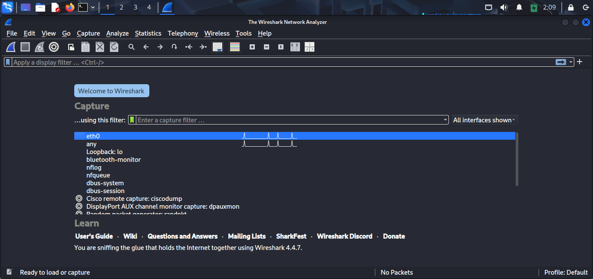
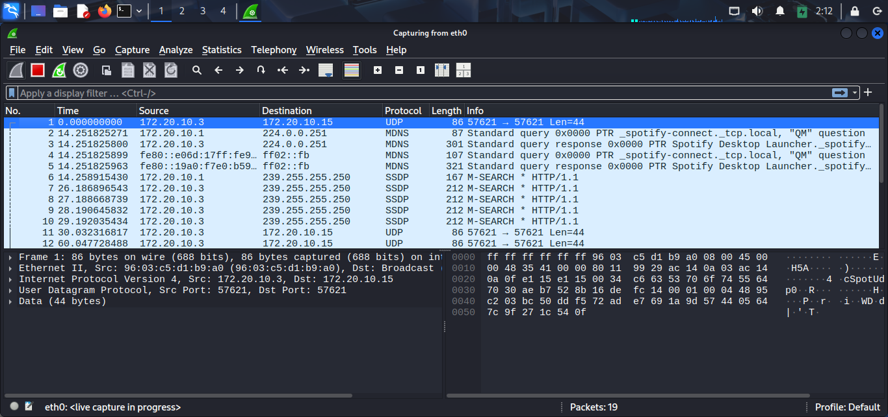
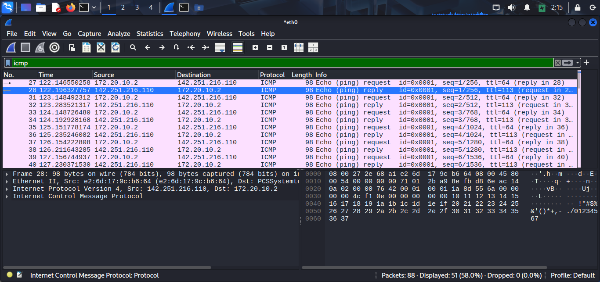
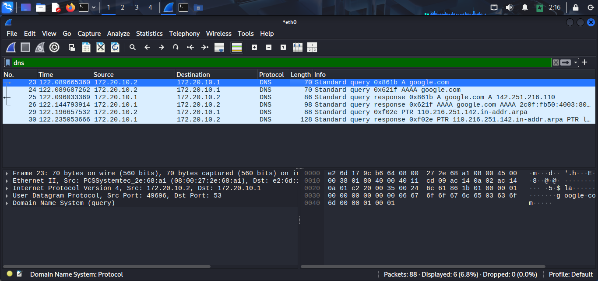
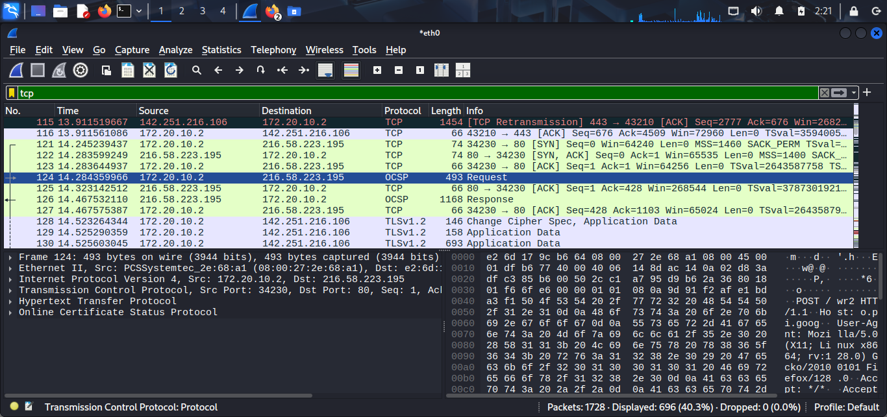
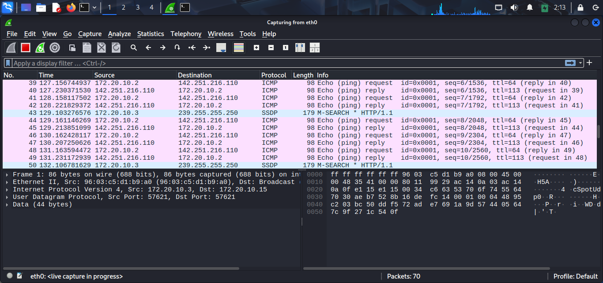
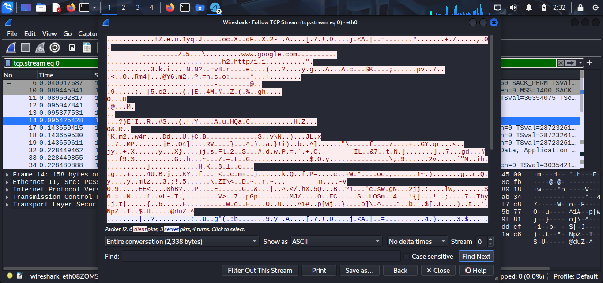
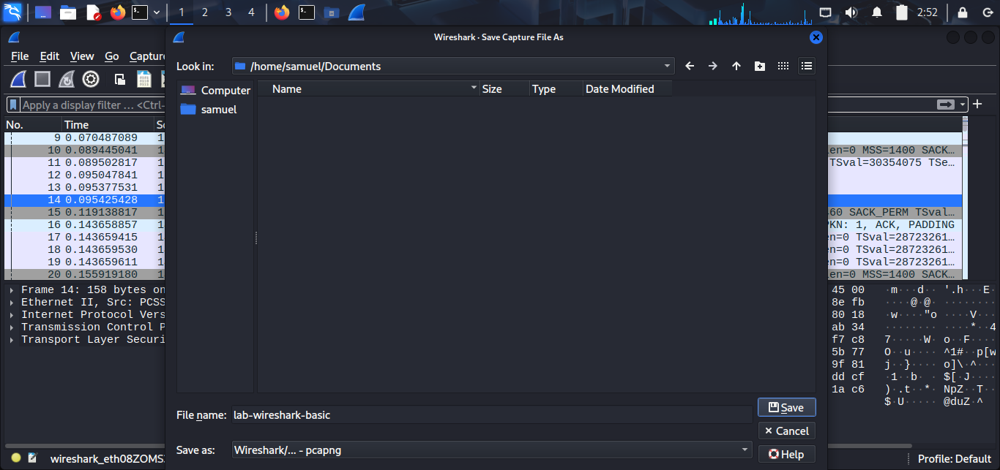

# Lab 04 – Wireshark Basics

## Objective

The objective of this lab was to learn how to capture, inspect, and analyze network traffic using Wireshark. I explored how network packets are transmitted, applied display filters, and analyzed common network protocols used in everyday communication.

---

## Environment

- **Operating System:** Kali Linux
- **Virtualization:** VirtualBox
- **Tool:** Wireshark
- **Network Interface:** `eth0` (or your active interface)

---

## Learning Objectives

By completing this lab, I aimed to:

- Understand what Wireshark is and its role in network analysis.
- Capture live network traffic.
- Apply display filters to isolate specific protocols.
- Analyze common network protocols such as ICMP, DNS, TCP, UDP, and ARP.
- Follow TCP streams to inspect network conversations.
- Save packet captures for future analysis.

---

## Background Theory

Wireshark is one of the most widely used network protocol analyzers in cybersecurity. It captures packets traveling across a network and allows analysts to inspect them in detail.

A network packet contains information such as:

- Source IP Address
- Destination IP Address
- Source MAC Address
- Destination MAC Address
- Protocol
- Payload (Data)

SOC Analysts use Wireshark to investigate suspicious network activity, troubleshoot connectivity issues, analyze malware communication, and understand how systems communicate over a network.

---

## Tasks Performed

### Task 1 – Open Wireshark

- Opened Wireshark.
- Identified the active network interface.
- Started packet capture.

---

### Task 2 – Capture Live Traffic

Captured live network traffic for approximately 30 seconds.

---

### Task 3 – Generate Network Traffic

Generated ICMP traffic by running:

```bash
ping google.com
```

Observed the ICMP Echo Requests and Echo Replies.

---

### Task 4 – Apply Display Filters

Practiced filtering packets using:

| Filter | Purpose |
|---------|---------|
| `icmp` | Display ICMP packets |
| `dns` | Display DNS packets |
| `tcp` | Display TCP packets |
| `udp` | Display UDP packets |
| `http` | Display HTTP packets |
| `arp` | Display ARP packets |

---

### Task 5 – Inspect Packet Details

Expanded packet details to observe:

- Ethernet II
- Internet Protocol (IPv4)
- TCP / UDP
- ICMP

Identified:

- Source IP Address
- Destination IP Address
- Source MAC Address
- Destination MAC Address

---

### Task 6 – DNS Analysis

Generated DNS traffic using:

```bash
nslookup google.com
```

Filtered DNS packets and observed:

- DNS Query
- DNS Response
- Returned IP addresses

---

### Task 7 – Follow TCP Stream

Generated TCP traffic using:

```bash
curl https://example.com
```

Used **Follow → TCP Stream** to inspect the communication between the client and the web server.

---

### Task 8 – Save Packet Capture

Saved the capture file as:

```text
lab-04-wireshark-basics.pcapng
```

---

## Screenshots

### Wireshark Home Screen



---

### Live Packet Capture



---

### ICMP Filter



---

### DNS Filter



---

### TCP Filter



---

### Packet Details



---

### Follow TCP Stream



---

### Saved Capture



---

## Observations

- Successfully captured live network traffic.
- Observed ICMP packets generated by the `ping` command.
- Identified DNS queries and responses after running `nslookup`.
- Applied display filters to isolate different network protocols.
- Examined packet headers to identify source and destination addresses.
- Followed a TCP stream to observe communication between the client and server.
- Saved the packet capture for future analysis.

---

## What I Learned

- How to capture live network traffic using Wireshark.
- The purpose of display filters.
- How ICMP, DNS, TCP, UDP, and ARP packets appear in packet captures.
- How to inspect packet details.
- How to reconstruct network conversations using Follow TCP Stream.
- The importance of saving packet captures for later investigation.

---

## Challenges Faced

Initially, identifying the correct network interface and generating traffic for analysis required some experimentation. Learning how different protocols appear in Wireshark helped me better understand network communication and packet analysis.

---

## SOC Relevance

Wireshark is an essential tool for Security Operations Center (SOC) Analysts because it helps to:

- Investigate suspicious network activity.
- Analyze malware communications.
- Troubleshoot network connectivity issues.
- Detect unauthorized connections.
- Inspect DNS requests and responses.
- Understand protocol behavior during security incidents.

Packet analysis is a core skill used in incident response, threat hunting, and forensic investigations.

---

## Key Takeaways

- Wireshark captures and analyzes live network traffic.
- Display filters make it easier to isolate specific protocols.
- DNS, ICMP, TCP, UDP, and ARP are among the most commonly analyzed protocols.
- Follow TCP Stream helps reconstruct client-server conversations.
- Packet captures provide valuable evidence during security investigations.

---

## Outcome

Successfully captured, filtered, and analyzed network traffic using Wireshark while documenting the packet analysis process as part of my SOC Analyst learning journey.
