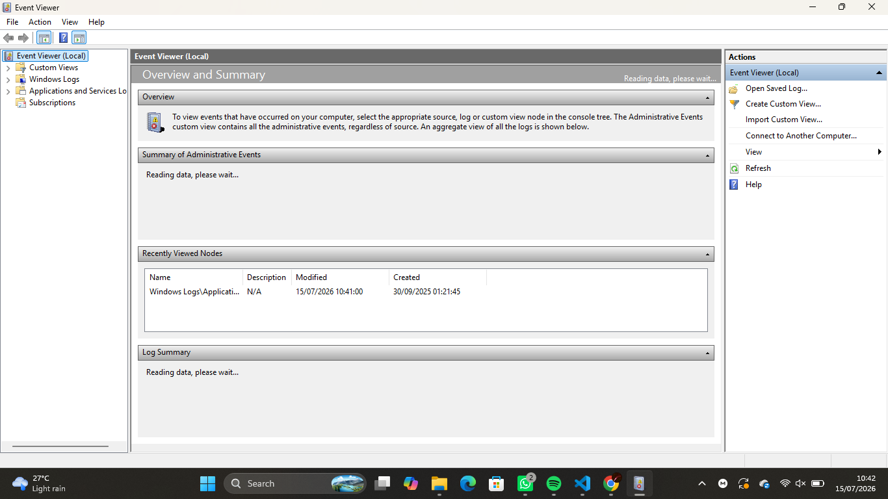
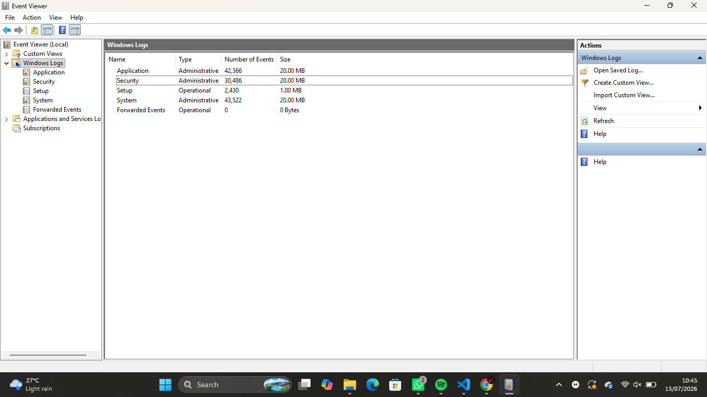
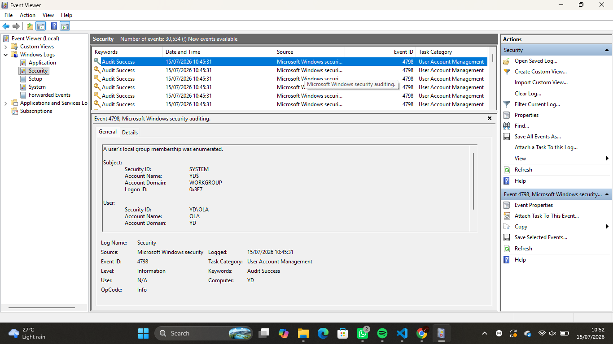
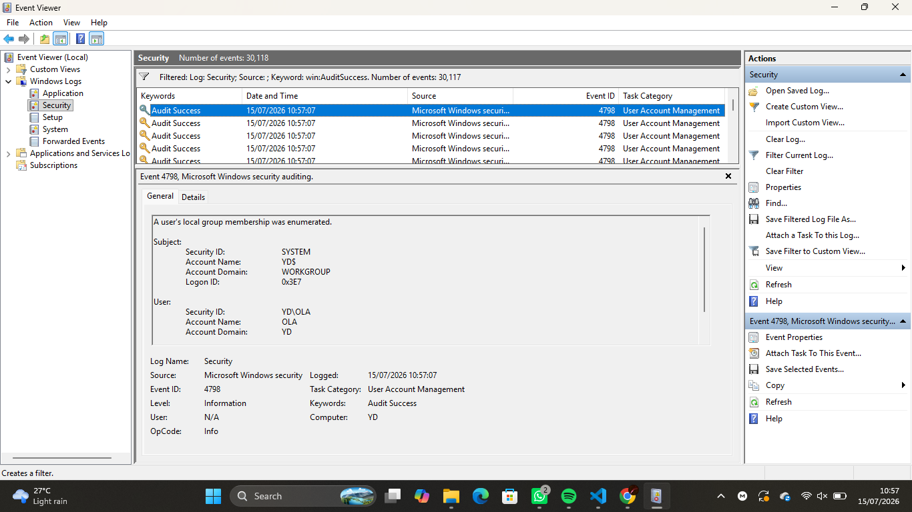
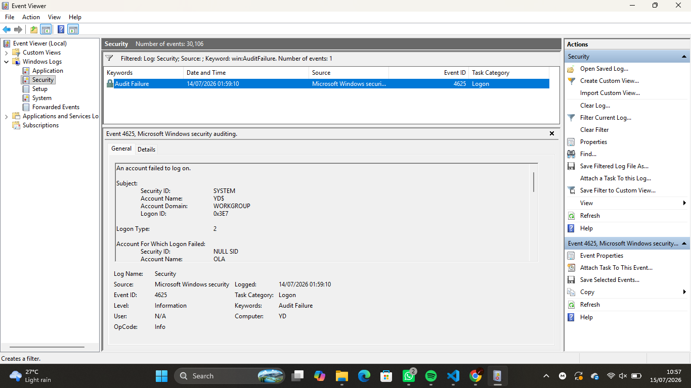
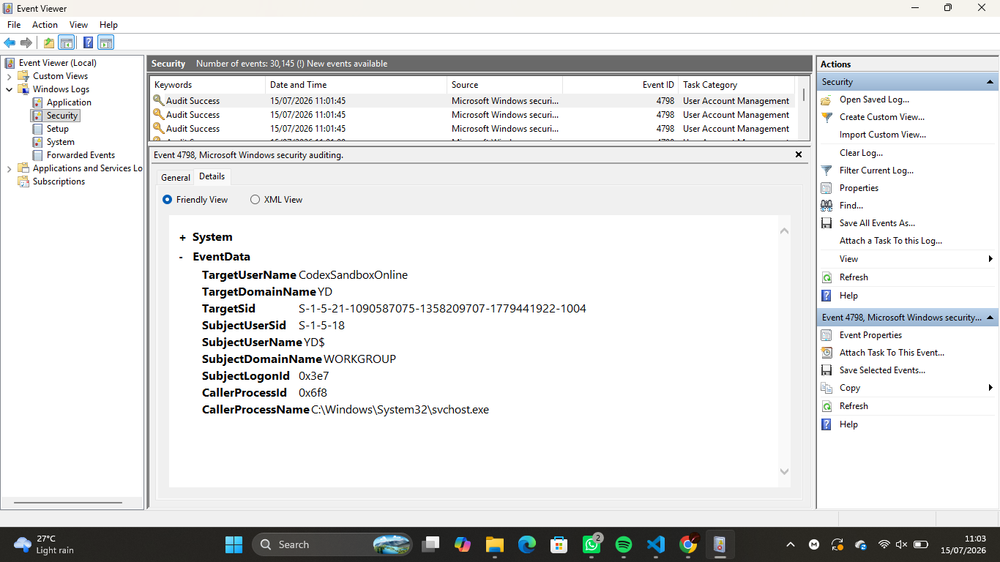
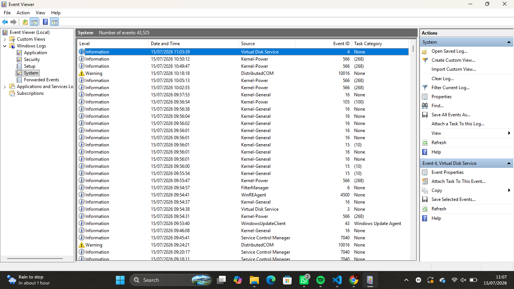
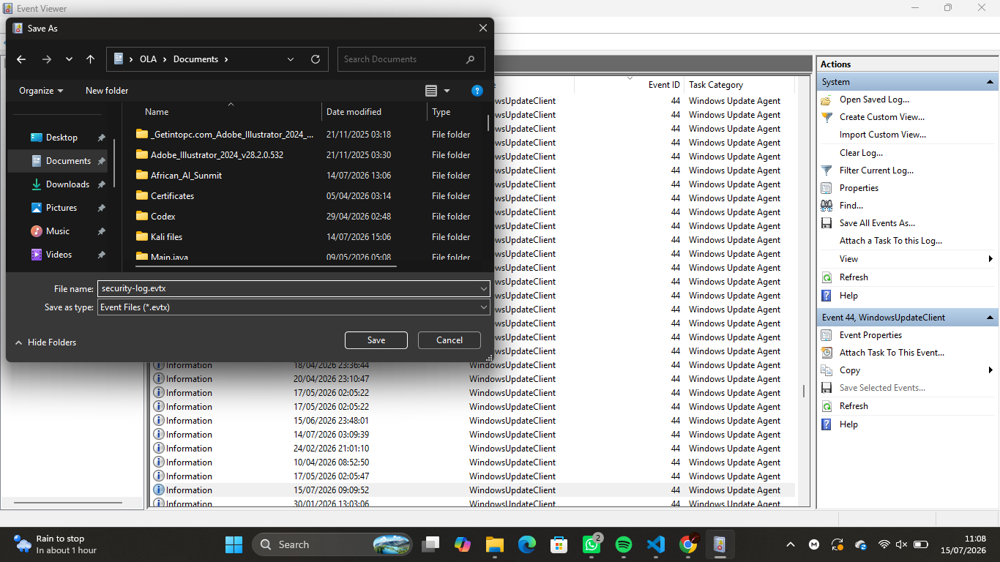

# Lab 06 – Windows Event Logs

## Objective

The objective of this lab was to learn how to use Windows Event Viewer to monitor, investigate, and analyze system, application, and security events. Windows Event Logs are a critical source of evidence used by Security Operations Center (SOC) Analysts during security monitoring, incident response, and forensic investigations.

---

## Environment

- **Operating System:** Windows 10/11
- **Tool:** Windows Event Viewer
- **Log Source:** Windows Event Logs

---

## Learning Objectives

By completing this lab, I aimed to:

- Understand the purpose of Windows Event Logs.
- Navigate Event Viewer.
- Explore different Windows log categories.
- Filter logs using Event IDs.
- Analyze security-related events.
- Export logs for future investigation.

---

## Background Theory

Windows records events generated by the operating system, applications, and users. These logs help administrators and SOC Analysts monitor system health, investigate security incidents, and identify suspicious activity.

The main Windows log categories include:

- Application
- Security
- System
- Setup
- Forwarded Events

Each event contains useful information such as:

- Event ID
- Date and Time
- Source
- User
- Computer Name
- Event Level
- Description

---

## Tasks Performed

### Task 1 – Open Event Viewer

Opened Windows Event Viewer using:

```text
eventvwr.msc
```

---

### Task 2 – Explore Windows Logs

Navigated through:

- Application
- Security
- System
- Setup
- Forwarded Events

---

### Task 3 – Analyze the Security Log

Opened:

```
Windows Logs → Security
```

Observed:

- Event IDs
- Event Level
- Source
- Date and Time

---

### Task 4 – Filter Security Events

Filtered the Security log to view specific Event IDs.

Examples:

- **4624** – Successful Logon
- **4625** – Failed Logon

---

### Task 5 – View Event Details

Inspected event details including:

- General Information
- Detailed XML View
- User Account
- Logon Type
- Time Created
- Computer Name

---

### Task 6 – Explore the System Log

Reviewed system-related events such as:

- Service Startup
- Driver Events
- System Boot
- System Shutdown

---

### Task 7 – Export Event Logs

Exported the Security log as:

```
security-log.evtx
```

This preserves the original event data for future analysis.

---

## Screenshots

### Event Viewer Home



---

### Windows Logs



---

### Security Log



---

### Filtered Security Events





---

### Event Details



---

### System Log



---

### Exported Event Log



---

## Observations

- Successfully accessed Windows Event Viewer.
- Explored the major Windows log categories.
- Observed security events generated by user logins.
- Filtered logs using specific Event IDs.
- Examined detailed event information.
- Exported event logs for future analysis.

---

## What I Learned

- Windows records important system and security events automatically.
- Event IDs help identify specific types of activity.
- Security logs provide evidence of authentication events.
- System logs record operating system activities.
- Event Viewer is an essential investigation tool for SOC Analysts.

---

## Challenges Faced

Initially, the large number of events made navigation challenging. Using filters and Event IDs made it much easier to locate relevant security events and understand the information recorded by Windows.

---

## SOC Relevance

Windows Event Logs are one of the primary sources of evidence used by Security Operations Center (SOC) Analysts. They help analysts:

- Investigate successful and failed logins.
- Detect suspicious user activity.
- Monitor system and service failures.
- Identify unauthorized access attempts.
- Support digital forensic investigations.
- Correlate events during incident response.

---

## Common Event IDs

| Event ID | Description |
|----------|-------------|
| - | Successful Logon |
| - | Failed Logon |
| - | Logoff |
| - | Special Privileges Assigned |
| - | User Account Created |
| - | User Account Deleted |

---

## Key Takeaways

- Windows Event Viewer is an essential forensic and monitoring tool.
- Event IDs allow analysts to quickly identify specific activities.
- Filtering logs improves investigation efficiency.
- Exporting logs preserves evidence for future analysis.
- Understanding Windows logs is a foundational SOC Analyst skill.

---

## Outcome

Successfully explored Windows Event Viewer, analyzed security and system events, filtered logs using Event IDs, and exported event data while documenting the process as part of my SOC Analyst learning journey.
