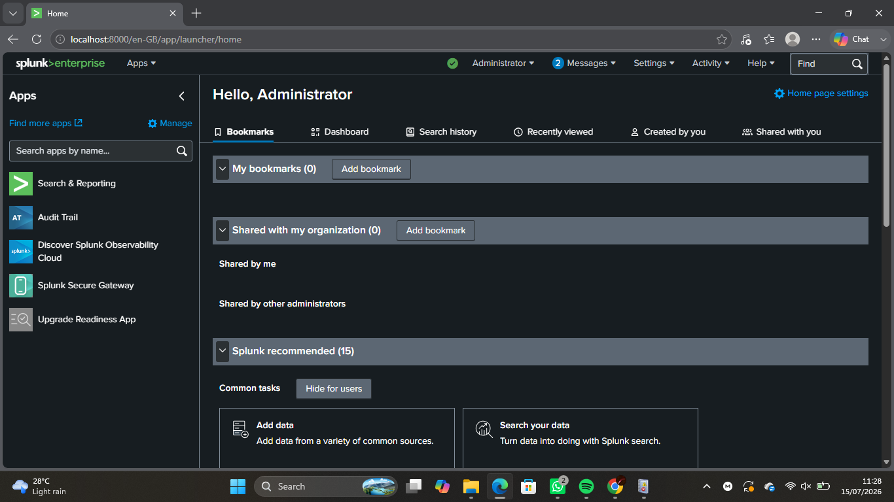
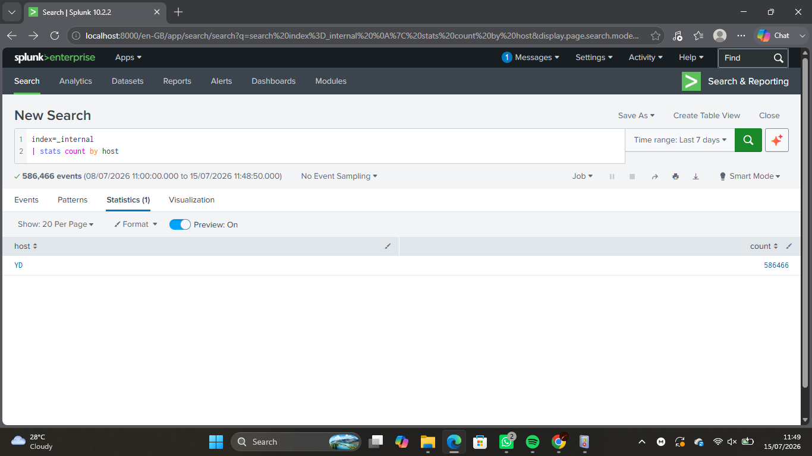
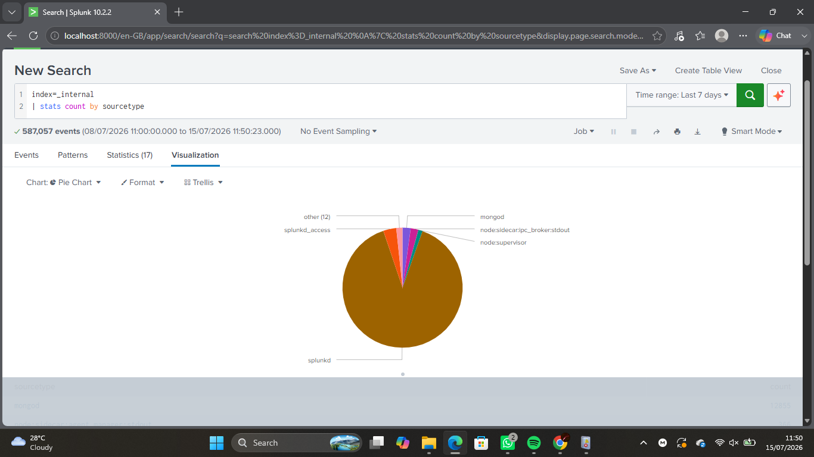

# Lab 07 – Splunk Basics

## Objective

The objective of this lab was to understand the fundamentals of Splunk, a Security Information and Event Management (SIEM) platform, by exploring its interface, searching indexed data, analyzing internal logs, and creating basic visualizations.

---

## Environment

- **Operating System:** Windows 11
- **Tool:** Splunk Enterprise 10.2.2
- **Data Source:** Splunk Internal Logs (`_internal` index)

---

## Learning Objectives

By completing this lab, I aimed to:

- Understand what a SIEM is.
- Learn the purpose of Splunk.
- Navigate the Splunk interface.
- Perform basic searches using SPL (Search Processing Language).
- Analyze indexed log data.
- Generate statistics from log events.
- Create simple visualizations.

---

## Background Theory

A Security Information and Event Management (SIEM) platform collects, indexes, and analyzes logs from different devices, applications, and operating systems. Splunk enables SOC Analysts to search large volumes of data, detect suspicious activity, investigate incidents, and create dashboards for monitoring.

The `_internal` index stores Splunk's own operational logs, making it a useful source for learning SPL before ingesting external data.

---

## Tasks Performed

### Task 1 – Verified Splunk Installation

Confirmed that Splunk Enterprise was installed and accessible through the web interface.

---

### Task 2 – Logged into Splunk

Accessed the Splunk web interface and explored the Search & Reporting application.

---

### Task 3 – Explored the Splunk Interface

Identified the following sections:

- Search
- Analytics
- Reports
- Alerts
- Dashboards
- Settings

---

### Task 4 – Searched Internal Logs

Executed:

```spl
index=_internal
```

Observed:

- Indexed events
- Event timestamps
- Host names
- Source types
- Raw log data

---

### Task 5 – Counted Events by Source Type

Executed:

```spl
index=_internal | stats count by sourcetype
```

Learned how different log sources are categorized inside Splunk.

---

### Task 6 – Counted Events by Host

Executed:

```spl
index=_internal | stats count by host
```

Observed which host generated the indexed events.

---

### Task 7 – Created a Visualization

Converted statistical results into a bar chart using Splunk's Visualization feature.

---

### Task 8 – Investigated Error Logs

Executed:

```spl
index=_internal log_level=ERROR
```

Reviewed internal error events generated by Splunk.

---

## SPL Commands Used

```spl
index=_internal

index=_internal | stats count by sourcetype

index=_internal | stats count by host

index=_internal log_level=ERROR
```

---

## Screenshots

### Splunk Login


---

### Splunk Home



---

### Search Internal Logs


---

### Source Types


---

### Hosts



---

### Bar Chart



---

### Error Events


---

## Observations

- Successfully logged into Splunk Enterprise.
- Queried the `_internal` index.
- Learned how Splunk stores and indexes events.
- Generated statistics using SPL.
- Visualized log data using charts.
- Investigated internal error messages.

---

## What I Learned

- Splunk is a SIEM platform used by SOC Analysts.
- SPL allows analysts to search and analyze logs efficiently.
- Internal logs provide insight into Splunk's own operations.
- Statistics and visualizations make large datasets easier to understand.
- Searching and filtering are essential skills for security investigations.

---

## Challenges Faced

Initially, my Splunk Enterprise license had expired, preventing searches from running. After resolving the licensing issue, I successfully queried the `_internal` index and completed the lab using Splunk's built-in log data.

---

## SOC Relevance

Splunk is one of the most widely used SIEM platforms in Security Operations Centers. SOC Analysts use Splunk to:

- Collect logs from multiple systems.
- Detect suspicious activity.
- Investigate security incidents.
- Monitor infrastructure health.
- Build dashboards and alerts.
- Support threat hunting and incident response.

---

## Key Takeaways

- Learned the basics of Splunk Enterprise.
- Performed searches using SPL.
- Explored indexed log data.
- Generated statistical reports.
- Built simple visualizations.
- Strengthened foundational SIEM skills for SOC analysis.

---

## Outcome

Successfully completed my first Splunk lab by navigating the platform, searching internal logs, generating statistics, creating visualizations, and understanding how SIEM tools assist SOC Analysts in monitoring and investigating security events.
