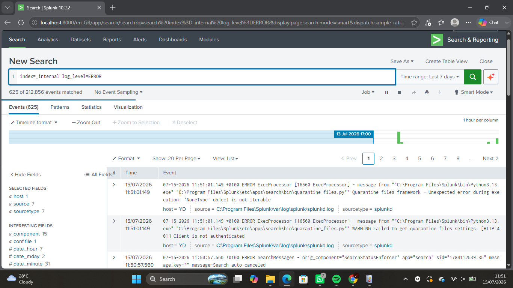
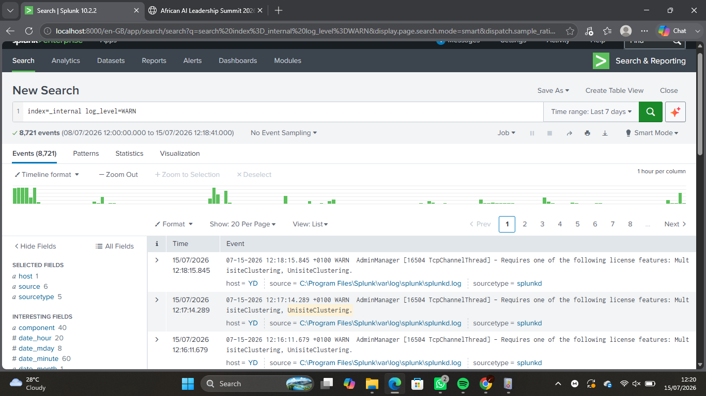
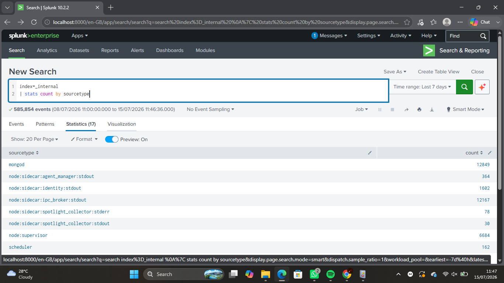
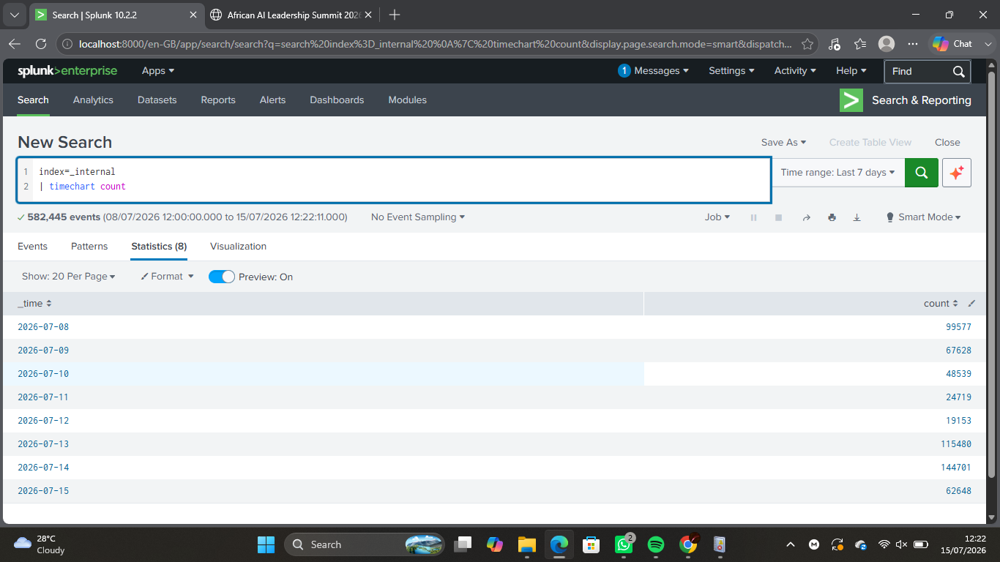
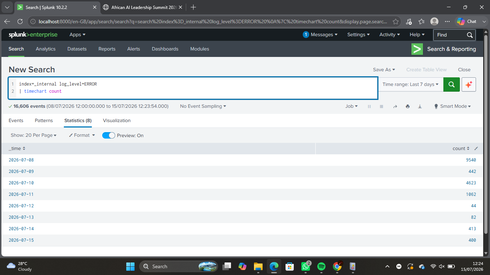

# Lab 08 – Threat Hunting Fundamentals

## Objective

The objective of this lab was to understand the fundamentals of threat hunting by proactively searching for suspicious activity using Splunk. Unlike traditional security monitoring, threat hunting is hypothesis-driven and focuses on identifying potential threats that may have bypassed automated security controls.

---

## Environment

- **Operating System:** Windows 11
- **Tool:** Splunk Enterprise
- **Data Source:** Splunk Internal Logs (`_internal`)
- **Technique:** Threat Hunting using Search Processing Language (SPL)

---

## Learning Objectives

By completing this lab, I aimed to:

- Understand the concept of Threat Hunting.
- Differentiate Threat Hunting from Incident Response.
- Understand Indicators of Compromise (IOCs) and Indicators of Attack (IOAs).
- Develop a hunting hypothesis.
- Use Splunk SPL to investigate log data.
- Document findings based on evidence.

---

## Background Theory

Threat Hunting is the proactive process of searching through logs and system activity to identify malicious behavior that may not have been detected by automated security tools.

Unlike Incident Response, which begins after an alert is generated, Threat Hunting starts with a hypothesis and uses available evidence to confirm or reject it.

### Threat Hunting Process

1. Develop a hypothesis.
2. Collect relevant log data.
3. Search and filter events.
4. Analyze findings.
5. Draw conclusions.
6. Document the investigation.

---

## Key Concepts

### Indicator of Compromise (IOC)

Evidence that suggests a system may have been compromised.

Examples:

- Malicious IP address
- Suspicious domain
- File hash
- Registry modification
- Malware file

### Indicator of Attack (IOA)

Evidence of attacker behavior rather than a known artifact.

Examples:

- Multiple failed logins
- PowerShell abuse
- Unusual process execution
- Unexpected DNS activity

---

## Hunting Hypothesis

> If a service is repeatedly failing, there should be an increased number of ERROR events recorded within the Splunk internal logs.

---

## Tasks Performed

### Task 1 – Explore Internal Logs

Executed:

```spl
index=_internal
```

Reviewed:

- Hosts
- Sources
- Sourcetypes
- Event timestamps

---

### Task 2 – Investigate Error Events

Executed:

```spl
index=_internal log_level=ERROR
```

Observed:

- Error messages
- Components generating errors
- Frequency of events

---

### Task 3 – Investigate Warning Events

Executed:

```spl
index=_internal log_level=WARN
```

Compared warning events with error events to identify trends.

---

### Task 4 – Analyze Hosts

Executed:

```spl
index=_internal
| stats count by host
```

Identified which host generated the indexed events.

---

### Task 5 – Analyze Event Sources

Executed:

```spl
index=_internal
| stats count by source
```

Determined which Splunk components generated the most events.

---

### Task 6 – Analyze Activity Over Time

Executed:

```spl
index=_internal
| timechart count
```

Observed changes in event volume over time.

---

### Task 7 – Validate the Hunting Hypothesis

Executed:

```spl
index=_internal log_level=ERROR
| timechart count
```

Used the results to determine whether error events occurred consistently or during specific periods.

---

## SPL Queries Used

```spl
index=_internal

index=_internal log_level=ERROR

index=_internal log_level=WARN

index=_internal | stats count by host

index=_internal | stats count by source

index=_internal | timechart count

index=_internal log_level=ERROR | timechart count
```

---

## Screenshots

### Internal Log Search


---

### Error Events



---

### Warning Events



---

### Host Analysis


---

### Source Analysis



---

### Timechart



---

### Hunting Investigation



---

## Observations

- Successfully searched Splunk internal logs.
- Identified both warning and error events.
- Compared event frequency across hosts and sources.
- Visualized activity over time.
- Applied a hypothesis-driven approach to log analysis.

---

## Findings

The investigation focused on identifying repeated error events within Splunk's internal logs.

After reviewing the data:

- Error events were successfully identified.
- Event frequency was visualized using a timechart.
- The available data did not indicate clear evidence of malicious activity.
- The exercise demonstrated how analysts validate hypotheses using available evidence rather than assumptions.

---

## Challenges Faced

Initially, the Splunk Enterprise license had expired, preventing searches from running. After resolving the licensing issue, the internal logs became available for analysis and the investigation was successfully completed.

---

## SOC Relevance

Threat Hunting is an essential function within a Security Operations Center (SOC). Analysts proactively search for suspicious behavior that may not trigger security alerts.

Threat Hunting helps organizations to:

- Discover hidden threats.
- Validate security controls.
- Detect attacker activity early.
- Reduce dwell time.
- Improve overall detection capabilities.

---

## Key Takeaways

- Threat Hunting is a proactive security activity.
- Investigations should begin with a clear hypothesis.
- Evidence should support or reject the hypothesis.
- SPL enables efficient searching and analysis of large log datasets.
- Documentation is an important part of every investigation.

---

## Outcome

Successfully completed a hypothesis-driven threat hunting exercise using Splunk. Investigated internal log data, analyzed warning and error events, examined event trends, and documented findings based on evidence while strengthening practical SOC Analyst investigation skills.
