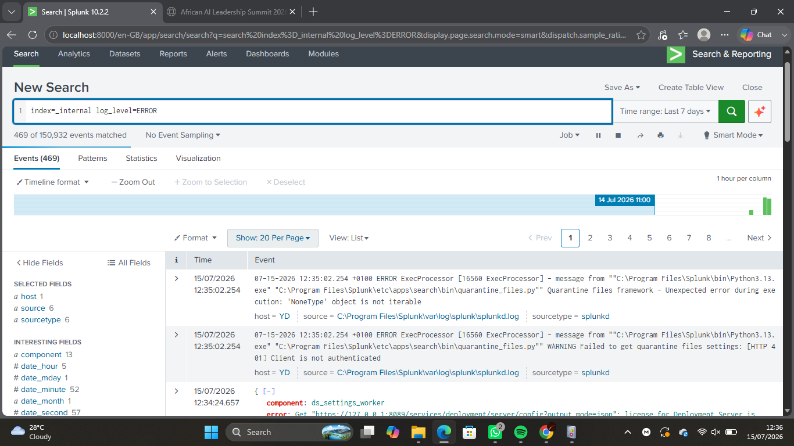
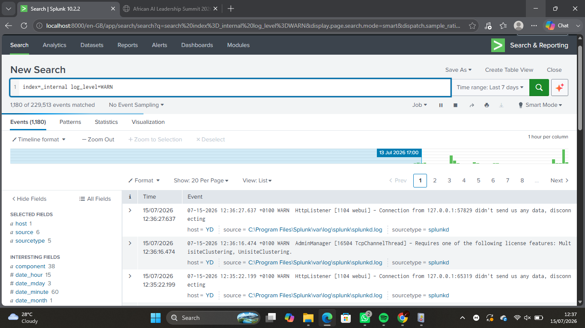
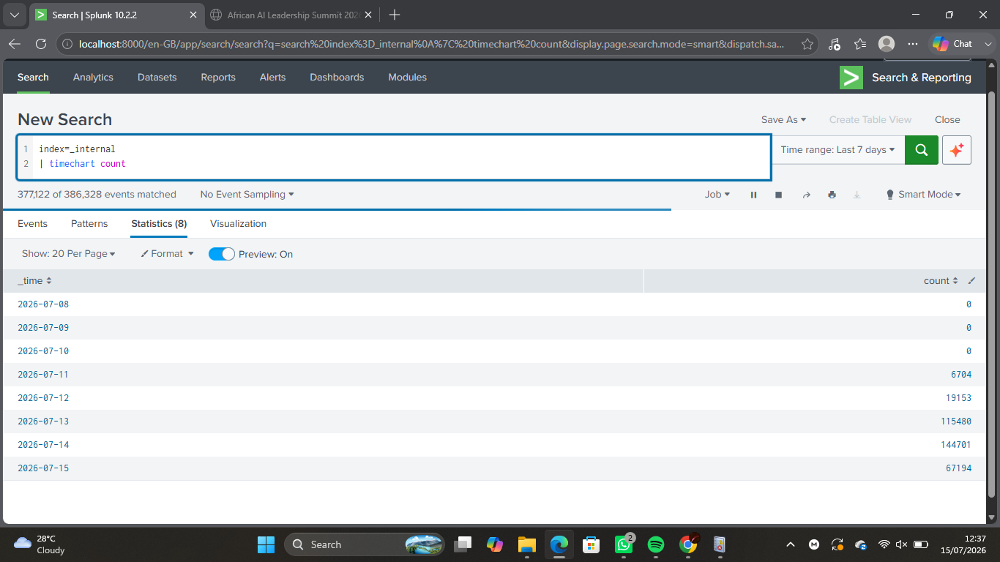
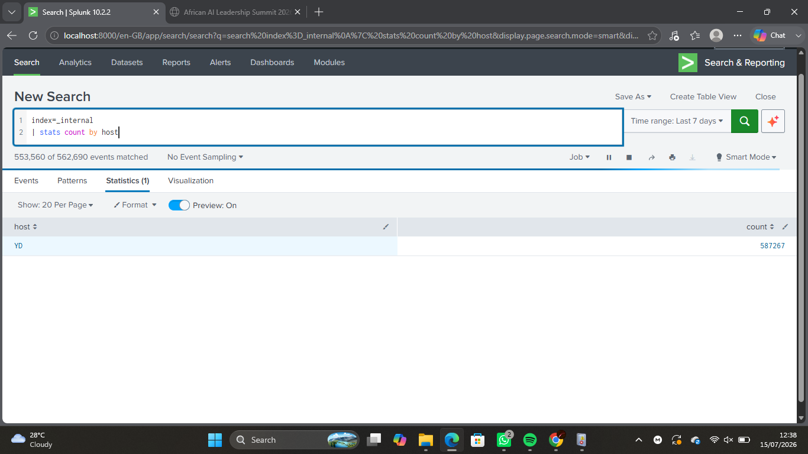
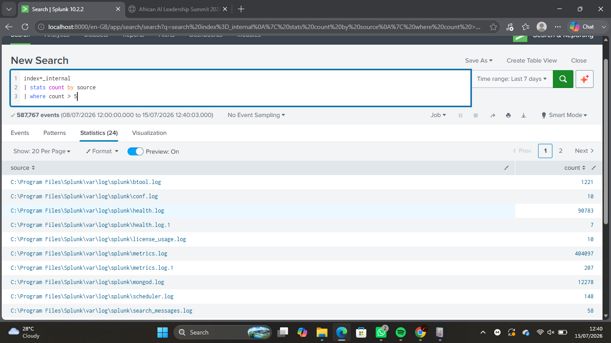

# Lab 09 – SIEM Detection Fundamentals

## Objective

The objective of this lab was to understand how Security Information and Event Management (SIEM) systems detect suspicious activity by analyzing log data and creating basic detection logic using Splunk.

---

## Environment

- **Operating System:** Windows 11
- **SIEM Platform:** Splunk Enterprise
- **Data Source:** Splunk Internal Logs (`_internal`)
- **Language:** Splunk Search Processing Language (SPL)

---

# Learning Objectives

By completing this lab, I learned how to:

- Understand the purpose of SIEM detections.
- Explain the SIEM detection lifecycle.
- Write basic detection queries using SPL.
- Analyze event patterns.
- Identify potential security events.
- Evaluate detection results.
- Differentiate between true positives and false positives.

---

# Background Theory

A Security Information and Event Management (SIEM) platform collects, normalizes, indexes, and analyzes logs from multiple systems.

A **detection rule** is a search or correlation that identifies activity matching predefined suspicious behaviors. When the rule conditions are met, the SIEM generates an alert for security analysts to investigate.

### SIEM Detection Lifecycle

1. Log Generation
2. Log Collection
3. Log Parsing
4. Log Indexing
5. Detection Rule
6. Alert Generation
7. SOC Investigation

---

# Detection Scenario

For this lab, I created basic detection searches using Splunk's internal logs to identify warning and error events and analyze system activity.

---

# Tasks Performed

## Task 1 – Explore Internal Logs

Executed:

```spl
index=_internal
```

Reviewed available events, hosts, sources, sourcetypes, and timestamps.

---

## Task 2 – Detect Error Events

Executed:

```spl
index=_internal log_level=ERROR
```

Observed error events generated by Splunk components.

---

## Task 3 – Detect Warning Events

Executed:

```spl
index=_internal log_level=WARN
```

Compared warning events with error events.

---

## Task 4 – Analyze Event Volume

Executed:

```spl
index=_internal
| timechart count
```

Visualized event activity over time to identify spikes.

---

## Task 5 – Analyze Hosts

Executed:

```spl
index=_internal
| stats count by host
```

Identified the hosts generating log events.

---

## Task 6 – Analyze Event Sources

Executed:

```spl
index=_internal
| stats count by source
```

Identified the most active event sources.

---

## Task 7 – Build a Detection Rule

Executed:

```spl
index=_internal log_level=ERROR
| stats count by source
| where count > 5
```

Created a simple detection query to identify sources generating repeated error events.

---

## Task 8 – Evaluate Detection Results

Reviewed the output to determine whether the detected activity represented expected system behavior or required further investigation.

---

# SPL Queries Used

```spl
index=_internal

index=_internal log_level=ERROR

index=_internal log_level=WARN

index=_internal
| timechart count

index=_internal
| stats count by host

index=_internal
| stats count by source

index=_internal log_level=ERROR
| stats count by source
| where count > 5
```

---

# Detection Rule

### Rule Name

Repeated Internal Error Events

### Detection Logic

```spl
index=_internal log_level=ERROR
| stats count by source
| where count > 5
```

### Purpose

Identify Splunk components generating a high number of internal error events.

### Expected Outcome

Generate a list of event sources with more than five recorded error events for further investigation.

---

# Screenshots

### Internal Events


---

### Error Detection



---

### Warning Detection



---

### Event Volume



---

### Host Analysis


---

### Source Analysis



---

### Detection Rule



---

# Observations

- Successfully queried Splunk internal logs.
- Identified warning and error events.
- Compared event activity across hosts and sources.
- Built a basic detection rule using SPL.
- Analyzed event frequency using statistical commands.

---

# Findings

The detection query successfully identified sources that generated repeated error events.

The observed events appeared to be related to normal Splunk operations rather than malicious activity. This demonstrates the importance of validating detection results before escalating them as security incidents.

---

# Challenges Faced

One challenge during the lab was understanding whether repeated internal error events represented suspicious activity. Further analysis showed that not every detection indicates malicious behavior, highlighting the importance of analyst judgment.

---

# SOC Relevance

SIEM detection is one of the core responsibilities of a SOC Analyst. Analysts rely on detection rules to identify suspicious activity, investigate alerts, reduce false positives, and improve an organization's ability to detect security threats.

---

# Skills Demonstrated

- SIEM Fundamentals
- Splunk SPL
- Log Analysis
- Detection Rule Creation
- Alert Analysis
- Security Investigation
- Data Visualization
- Analytical Thinking

---

# Key Takeaways

- SIEM platforms automate log analysis.
- Detection rules search for predefined suspicious behavior.
- SPL is used to create and refine detections.
- Not every detection is malicious.
- Analysts must validate alerts before escalation.

---

# Outcome

Successfully created and evaluated basic SIEM detection queries using Splunk. Analyzed internal log data, developed a simple detection rule, and gained practical experience with the fundamentals of security monitoring and alert generation.
